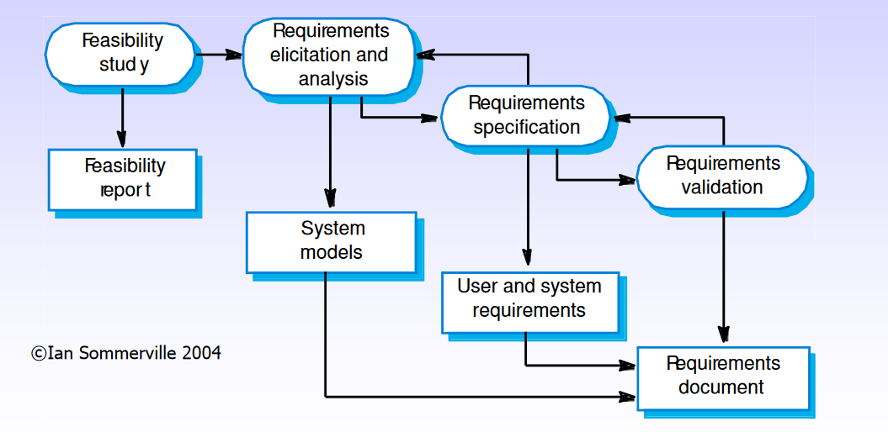
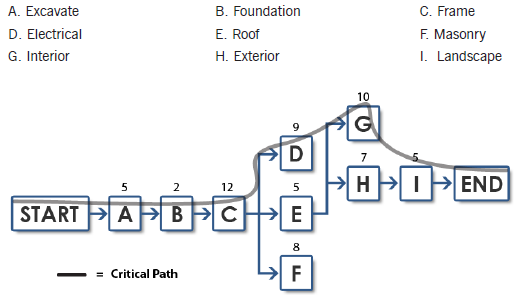
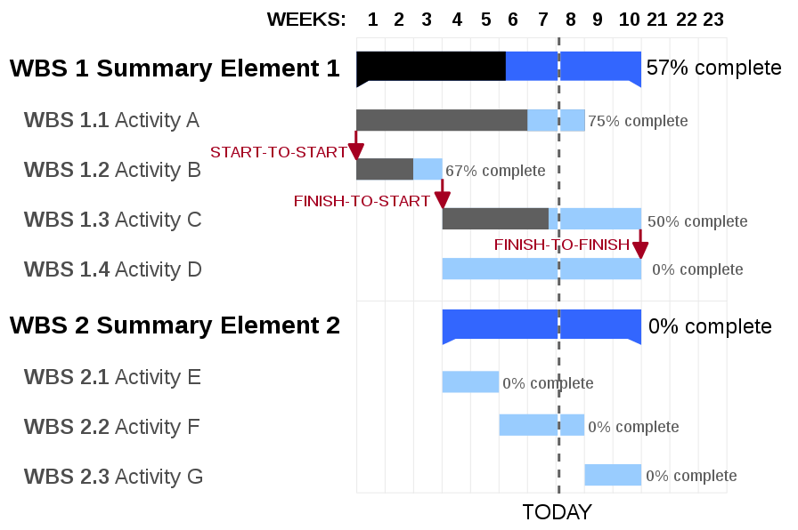
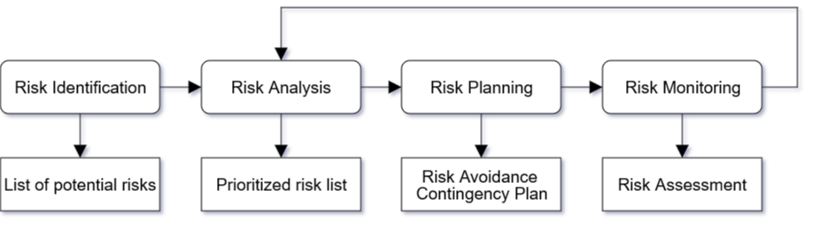

Requirements engineering (RE)
=============================

Requirements engineering is the process of:

-   Understanding and defining what services are required from the
    desired system

    (*i.e.* **what the customer wants**)

-   Identifying the **system constraints**

    (*e.g.* deadlines, hardware specifications, budget, standards)

At the end of the requirements engineering process, a **requirements
specification document** is produced.

RE addresses:

-   The development and validation processes for **gathering,
    representing, and analysing** system requirements

-   The methods for **transforming** these requirements **into
    specifications** for design and implementation

The process of RE is in software development is an **iterative
process**. Often, it's not possible to draw an exact line between the
definition of requirements and the actual implementation.

System identification
---------------------

In order to uncover the system requirements, it's necessary to ask some
questions\...

Purpose
-------

-   **What is the purpose of the system?**

They will likely lead to functions and sub-functions that the system
will need to carry out.

Scope
-----

-   **What is included in the system?**

Since the system being analysed may be part of a larger environment,
it's important to understand what parts of the system we need to provide
or not. This is fundamental to avoid missing required components or
adding to non-requested ones.

It refers more to what could be implemented in the system, also in the
future.

Boundary
--------

-   **What is inside, what is outside?**

We need to identify which of the existing components will be part of the
system and which won't.

Context
-------

-   **What is the environment of the system?**

-   **What external entities may affect the system and its operation?**

We also need to think about the environment in which the system will
have to run and what could influence it. E.g. hardware, network, etc.

Types of RE
-----------

### Greenfield Engineering

-   Development starts from scratch; no prior system exists.

-   The requirements are extracted from the client/users.

-   **Triggered by user needs**

### Re-engineering

-   Re-design and/or re-implement an existing system using newer
    technology

-   **Triggered by new technology**

### Interface Engineering

-   Provide more/new services for an existing system

-   **Triggered by new technology or new market needs**

Types of requirements
---------------------

### Functional requirements

-   Describe the **interactions** between the system and its environment
    and/or its users.

-   Are **independent from the implementation**.

E.g.

-   The time displayed must be based on the user location.

### Non-functional requirements

-   Describe the parts of the system non-related to the functional
    aspects:

E.g.

-   Hardware specifications

-   Bandwidth consumption

-   Etc.

### Constraints (pseudo-requirements)

-   **Limitations** on what we are allowed to do.

-   Might be imposed by the client or the environment in which the
    system will operate.

E.g.

-   The software must be implemented in PHP.

Some of the things that usually **are not** part of the requirements:

-   Implementation technology

-   Implementation language

-   Development methodology

-   Reusability

-   Etc.

These *should* *not* be decided by the client.

Process oriented view
---------------------

{width="4.47761154855643in"
height="2.1826859142607176in"}

[For each one of these stages, a document is produced.]{.underline}

### Feasibility study

*"Do we need this? Can we do it?"*

This part of the process is aimed at understanding if the user can be
satisfied using **current software and technologies**, and whether the
development will be **cost effective** and **within the budget**.

This should be a quick process.

The report allows the client to decide whether they want to proceed with
a more detailed and costly analysis.

### Requirements elicitation and analysis

During this part of the process, requirements are extracted from the
stakeholders.

Two complementary approaches used to elicit requirements are:

#### Viewpoints

> They are a way of identifying *stakeholders* and other sources from
> which requirements can be extracted.
>
> Perspectives from which the system can be look at, i.e. different
> people.

#### Scenarios

> Real-life examples of how the system will be used (use cases in UML).
>
> The user is asked to explain in detail how they would perform a task.

Once we have all the requirements, we need to **analyse** them in order
to discover problems or inconsistencies. The requirements are then given
back to the stakeholders. Finally, requirements may be rewritten.

A checklist might be used to verify each requirement.

##### Heuristics for finding scenarios

Some of the questions that may be asked are:

-   What are the primary tasks that the system needs to perform?

-   What data will the actor create, store, change, remove, or add in
    the system?

-   What changes or events will the actor of the system need to be
    informed about?

If the system already exists (re-engineering or interface engineering),
ask to speak with the end user. Some resistance might be expected if not
working directly for the final user (contractors).

#### Analysis & Validation

Once all the requirements have been elicited from the stakeholders, they
need to be validated to avoid additional costs later. The question to be
answered at this stage is "**Have we got the right requirements?**"

***+++++ A final draft of the requirements is agreed upon. +++++***

-   Analysis works with raw requirements as elicited from the
    stakeholders

-   Validation works with a final draft of the requirements document

### Requirements specification

Viewpoints and scenarios are used to understand the current
requirements, but also to communicate with the stakeholders and elicit
additional information. They must be represented in a precise and
well-structured way, but they should be easy enough so that also
stakeholders can understand them.

#### Informal & semi-formal representation

Different representations can be used to represent the same scenarios,
such as graphics or stylised natural language (**pseudo-code**), but
semi-formal representations like **UML diagrams** are probably better
because it's easier to translate them into the actual code.

#### Formal representations

More formal representations should be used when working on critical
projects where ambiguities might cause harm to people, e.g. avionics,
finance, medical applications, etc.

They may be used for expressing:

-   Properties of objects

-   Objects in involved in (inter)actions

-   Relationships between inputs and outputs

This formalization might be useful to:

-   Disambiguate requirements and scenarios

-   Perform mathematical analysis/checking of the design

-   Assist in automated testing of the system

### Validation techniques

Some validation techniques that can be used to ascertain the correctness
of the elicited requirements are:

#### Requirements reviews

-   Systematic manual checking of the of the requirements

-   If possible, stakeholders should be involved in review the process.

#### Prototyping

-   An executable model of the system is used to check the requirements

-   Allows clients/stakeholders to test dummy scenarios

#### Test-case generation

-   Development of tests for each requirement

Each requirement must be **SMART**:

-   Specific

-   Measurable

-   Achievable

-   Realistic

-   Time-bound

#### Requirement based testing

**Inventing requirements** tests could be an effective validation
technique to **discover missing or ambiguous information** in the
requirements.

#### Hard to test requirements

Some requirements that might not be easily testable are those relative
to the **system as a whole**, requirements for **error handling** or
system failures, or **non-functional requirements** that require large
sets. Formal representations may be useful in these cases.

For further information, read Ian Sommerville's book on Requirements
Engineering (chapter 4).

Project management
==================

Project management is concerned with software:

-   Being **delivered on time**

-   **Meeting the requirements**

It is needed because software development is subject to

-   **budget**

-   **schedules**

set by the organization or the client that commissioned the software.

Challenges
----------

Since software is not tangible and requirements tend to be rather
flexible because of the changes that happen every day (politics,
technologies, market, etc.), therefore it is necessary to carefully
manage all the steps of the project. An additional challenge is the lack
of a standardised process due to the uniqueness of software projects.
Different perspective of the people participating in the project need to
be considered. **Try to satisfy as many stakeholders as possible.**

Management activities
---------------------

The activities involved in managing a software are:

-   **Proposal** writing

-   **Project** **planning** and scheduling

-   **Project** **costing**

-   **Personnel selection** and evaluation

-   **Project monitoring** and reviews

-   **Report writing** and presentations

Software Project Management Plan
--------------------------------

-   The **controlling document** for a software project.

<!-- -->

-   Specifies the technical and managerial approaches to develop the
    software product.

-   The project plan sets out the **resources available**, the **work
    breakdown**, and the **schedule**.

-   Companion document to requirements specification: Changes in either
    may imply changes in the other document.

-   SPMP may be part of the project agreement.

Project agreement (written document that defines the following for a
client):

-   The scope, duration, cost and deliverables for the project

-   The exact items, quantities, delivery dates, delivery location.

-   It can be a statement of work, a business plan, or a project charter
    -- the basis for a contract

The project plan may address aspects of the project work, such as:

-   **Quality plan**: quality procedures and standards to be used for
    system validation

-   **Validation plan**: approach, resources, and schedules for system
    validation

-   **Configuration management plan**: configuration managements
    procedures and structures used

-   **Maintenance plan**: predicts maintenance requirements, costs, and
    effort required

-   **Staff development plan**: describes how the skills and experience
    of the project team members are to be developed

And/or, aspects of the development process:

-   **Introduction**: briefly, the objectives of project and sets
    constraints (e.g., budget, time, etc.) which affect project
    management

-   **Project organisation**: way in which development team are
    organised, the people involved and their roles in the team

-   **Risk analysis**: possible project risks, their likelihood of
    occurrence, and risk reduction strategies proposed

-   **Hardware/software**: support required for the development; if
    hardware to be bought, estimates of price and delivery schedule

-   **Work breakdown**: breakdown of project into activities and tasks,
    and identifies milestones and deliverables associated with each task

-   **Project schedule**: dependencies between activities, estimated
    time required to reach each milestone, and allocation of people to
    activities

-   **Monitoring and reporting mechanisms**: management reports which
    should be produced, when, and the monitoring mechanism.

Road Map for Project Management
-------------------------------

1\. Understand the **project content, scope & time frame**

2\. Identify **development process**: methods, tools, languages,
documentation and support

3\. Determine **organizational structure**: organizational elements
involved

4\. Identify **managerial process**: responsibilities of the participants

5\. Develop **schedule**: times at which the work portions are to be
performed

6\. Develop **staffing plan**

7\. Begin **risk management**

8\. Identify **documents** to be produced

9\. **Begin** the process

On-going monitoring, reviewing\...

Project scheduling
------------------

In order to finish a project in time it's necessary to **divide** it
**into a set of tasks** and create a schedule **allocating** the correct
amount of **time and resources** for each of them.

Tasks should be organised to make an optimal use of the available
workforce, while minimizing the dependencies between them.

### Activity network diagram

"An **Activity Network Diagram** is a diagram of project activities that
shows the sequential relationships of activities using arrows and nodes.
An [activity network
diagram](http://www.sixsigmadaily.com/activity-network-diagram/) tool is
used extensively in project management and is necessary for the
identification of a project's critical path (which is used to determine
the expected completion time of the project)." -*sixsigmadaily*

{width="5.034783464566929in"
height="2.8826071741032373in"}

### Activity timeline: Gantt chart

"A **Gantt chart** is a type of [bar
chart](https://en.wikipedia.org/wiki/Bar_chart) that illustrates a
[project
schedule](https://en.wikipedia.org/wiki/Schedule_(project_management)).
Gantt charts illustrate the start and finish dates of the terminal
elements and summary elements of a
[project](https://en.wikipedia.org/wiki/Project). Terminal elements and
summary elements comprise the [work breakdown
structure](https://en.wikipedia.org/wiki/Work_breakdown_structure) of
the project. Modern Gantt charts also show the
[dependency](https://en.wikipedia.org/wiki/Dependency_(project_management))
(i.e., precedence network) relationships between activities. Gantt
charts can be used to show current schedule status using
percent-complete shadings and a vertical \"TODAY\" line as shown here."
-*Wikipedia*

{width="5.032345800524935in"
height="3.347826990376203in"}

### Tasks

Tasks are activities that have been assigned to a resource the smallest
units that should be used for planning and tracking, yet they should be
large enough to avoid micromanagement. They have a finite duration,
limited resources, and produce tangible results when complete.

Tasks need to be specified by using the following:

-   **Name** (description of work that needs to be done)

-   **Preconditions** for starting, **duration**, required **resources**

-   **Outcomes** and **acceptance criteria**

-   **Risk involved**

*Example of tasks:*

-   Write unit test for class "Example"

-   Write user manual

-   Schedule code review

Finding the right size for a task is problematic because the team may
not know how to decompose the problem into more tasks, but they should
be decomposed into sizes that allow monitoring.

### Activities

Activities are major units of work that are assigned exact dates and
that consist of a number of smaller activities or **tasks**. They
culminate in project **milestones** which are internal **checkpoints
used to measure progress**.

Activities might be grouped into larger activities in order to establish
a hierarchical structure for the project and to allow separation of
concerns.

### Functions

A function is an activity, or a set of activities, that span the
duration of the project.

*Examples of functions are:*

-   Project management

-   Configuration management

-   Documentation

-   Quality control

-   Training

Risk management
===============

One of the most important project management tasks is risk management.
It is concerned with **identifying the risks** and drawing up plans for
minimising their effect on a project. A risk is the probability that
some adverse circumstance will occur. Risks can affect **schedules or
resources, quality or performance** of the software being developed,
while **business risks affect the organization** developing or procuring
the software.

{width="6.268055555555556in"
height="1.7986111111111112in"}

*Image from Vittorio Iocoland*

The process
-----------

-   **Risk identification**

Identify project, product and business risks

-   **Risk analysis**

Assess the likelihood and consequences of these risks

-   **Risk planning**

Draw up plans to avoid or minimise the effects of the risk

-   **Risk monitoring**

Monitor the risks throughout the project

Risk identification
-------------------

The team leader may be asked to identify the risks, or the group could
identify all the risks they can think of. Additionally, a checklist that
may be used to identify common risk in projects is the following:

-   **Technology risks**

    A database is not fast enough for the amount of transactions the
    system will handle

-   **People risks**

    It is not possible to recruit people with the necessary experience

-   **Organisational risks**

    The manager is replaced in the middle of the project

-   **Requirements risks**

    Changes to requirements require to rework major parts of the design

-   **Estimation risks**

    The time required to develop the software is underestimated

Risk analysis
-------------

The probability and seriousness of each risk has to be assessed.
Depending on the probability of it happening, a risk may be categorised
as very low, low, moderate, high, or very high. Its consequences may be
insignificant, tolerable, serious, catastrophic.

Risk planning
-------------

Each risk has to be considered so that different strategies can be
developed:

-   **Avoidance strategies**

    The probability that the risk will arise is reduced using opportune
    strategies

-   **Minimisation strategies**

    The impact of the risk on the project or product will be reduced

-   **Contingency plans**

    If the risk arises, contingency plans are in place to deal with that
    risk

Risk monitoring
---------------

-   **Assess** each identified risk **regularly** to decide whether it
    is becoming less or more probable.

-   Also **assess** whether the **effects** of the risk **have
    changed**.

-   Each key risk should be **discussed** at management progress
    meetings.

Team organization & Teamwork
============================

Advantages of working in a team
-------------------------------

There are many reasons people to work in a team. In organizations, teams
allow to:

-   **Accomplish projects** that a single person could not do

-   **Brainstorm** more solutions

-   **Detect flaws** in solutions

-   Build a **workplace community**

Exposure to teamwork is considered valuable in the educational process:

-   Exposure to **different points of view**

-   Increases **communication skills**

-   **Critical thinking and evaluation skills**

-   **Conflict resolution** **skills**

The BCS, The Chartered Institute for IT promotes teamwork as a
professional development aspect for computing degrees.

Disadvantages of adding more people to a team
---------------------------------------------

-   More **communication lines**

-   Training **cost/time**

-   Lower **productivity**

-   **Brook\'s Law**: adding more people to a late project makes it
    later

Team size
---------

*"When effective decision-making is required, **three selected teams of
four** are better than one group of twelve. \[\...\] **small teams**
deliberating separately **can quickly reach significant decisions**.\"
-- Meredith Belbin*

Although working in a team is mostly effective, a large team should be
avoided because:

-   Lines of communication are added for each member

    n x (n - 1) ÷ 2 where n is the team size

-   Large teams have too much overhead and are hardly effective

-   The approximate optimal range seems to be from 3 to 7 members, even
    though big company CEOs think that the optimal range is from 5 to 7.

Team organization
-----------------

There are different ways of organizing a team. The most common are:

-   **Hierarchical** organization: pyramid with the decision makers at
    the top.

-   **Egoless programming peer**: each member of the team is on the same
    level.

-   **Egoless groups with leaders**: many small groups that communicate
    with each other by electing a leader.

-   **Project-based** organization: many small groups organized with
    hierarchies are themselves part of a bigger hierarchy.

Team dynamics
-------------

**Tuckerman and Jensen**'s model is commonly accepted to describe how
teams form and become productive. The model is divided in 4 stages:

-   **Forming**: the members try to determine the purpose of the group
    and the role they will play

-   **Storming**: the members try to resolve their differences of
    opinion

-   **Norming**: a common understanding of the goals and the functioning
    of the team is reached

-   **Performing**: the team members have a clear understanding of how
    they will contribute and interact

Meredith Belbin\'s Roles
------------------------

Meredith Belbin identified nine **team roles**. These roles are:

-   **Plant**: Generates ideas and solves difficult problems.

-   **Coordinator**: Clarify goals and delegates tasks effectively.

-   **Monitor**/**Evaluator**: Sees all options and judges accurately.

-   **Implementer:** Turns idea into actions and organises work that
    needs to be done.

-   **Completer**/**Finisher**: Searches out errors. Polishes and
    perfects.

-   **Resource Investigator**: Explores opportunities and develops
    contacts.

-   **Shaper**: Has the drive and courage to overcome obstacles.

-   **Team worker**: Listens and averts friction.

-   **Specialist**: They provide specialist knowledge and skills.

**\
**

Legal, Social, Ethical and Professional Issues
==============================================

Professional issues
-------------------

In order to become a *professional,* one or more requirements might be
necessary:

-   Intensive **course of study**

-   **Professional practice**

-   **Professional development** (further study after beginning
    professional practice)

-   **Accreditation and certification** to demonstrate an adequate level
    of competence

### Profession

Professions need to ensure that knowledge and skills are put to
**socially responsible** uses. This is usually achieved by ensuring that
all the members of a profession follow the same **code of ethics**
and/or a **code of conduct** (or practice). This implies that a
profession has an identity, usually manifested as **professional
society**.

A profession operates on two different levels:

-   **Practitioner level**: the individual being part of a profession.

-   **Infrastructure level**: structures and people that work to
    maintain the profession by providing education, accreditation,
    certification schemes, etc.

### Basic technical knowledge

A professional computer scientist must have:

-   A **firm foundation** in the critical areas of the field

-   An **in-depth knowledge of one or more areas of the field**,
    depending upon the person's area of practice

A well-educated computing scientist should be able to apply fundamental
concepts and techniques of:

-   **Computation**

-   **Algorithms**

-   **Computer design**

Being a professional also means **engaging in Continuous Professional
Development** (CPD).

### Professional bodies

Being a professional means being a member of a professional body.

In the UK this means being a member of either:

-   Institution of Engineering Technology (**IET**)

-   **BCS**, The Chartered Institute for IT

In the USA:

-   Association for Computing Machinery (**ACM**)

-   Institution of Electrical and Electronic Engineer (**IEEE**)

The computing profession *in the UK* is mainly treated as
**engineering**.

### Why is it important to be a Professional

-   Recognition by

    -   Peers

    -   Clients

    -   External Bodies

    -   The Public

-   Continuing professional development

    -   Preservation of qualification standards

-   Lobbying

-   Networking

-   Access to learned society activities

-   Financial and other services

-   Professional register

Legal issues
------------

The most important laws that a computer scientist should remember are:

1.  ### 1990 -- Computer Misuse Act: 

    -   **Unauthorised Access** ─ accessing (or attempting to) private
        computer material.

    -   **Unauthorised Access for further offence** ─ situations for
        example where the material obtained was used to access a
        person\'s bank account.

    -   **Unauthorised Modification** ─ modifying private computer
        material. This covers issues such as planting viruses, malicious
        deletion of files or altering bank account details.

### 1984-1988 -- Data Protection Act:

Data Protection Act states that personal data must be:

-   Processed fairly and lawfully

-   Obtained only for one or more specified and lawful purposes.

-   Adequate, relevant and not excessive in relation to the purpose or
    purposes for which they are processed.

-   Accurate and, where necessary, kept up to date.

-   Not be kept for longer than is necessary for their purpose.

-   Processed in accordance with the rights of data subjects
    (individuals).

-   Protected with appropriate technical and organisational measures,
    against unauthorised or unlawful processing and against accidental
    loss or destruction, or damage.

-   Not transferred to a country or territory outside the European
    Economic Area (EEA) unless that country or territory ensures an
    adequate level of protection for the rights and freedoms of data
    subjects in relation to the processing of personal data.

> It was deemed to be *ineffective against (D)DoS attacks*, that's why
> this aspect had to be "fixed" by the Police and Justice Act.

2.  ### 2000 -- Freedom of Information Act (FOIA):

    -   Grants **the public** access to information held by **public
        authorities**. In **conflict** with the **Data Protection Act**.

3.  ### 2000 ­-- Regulations of Investigatory Powers Act (RIPA):

    Empowers the government to:

    -   Demand that an ISP provides access to a customer\'s
        communications (data) in secret.

    -   Demand your decryption keys so that they can access any
        encrypted data on your computer.

    -   Further activities.

4.  ### 2003 -- Privacy and Electronic Communications Regulations:

    It came into force on 11 Dec 2003 and concerns electronic marketing
    and the

    confidentiality of electronic data traffic.

5.  ### 2006 -- Police and Justice Act:

    It introduced new offences concerned with "impairing the operation
    of a computer" (**(D)DoS** attacks) including making and
    distributing hacking tools. This caused legal problem for those who
    created tools for **penetration testing** since they could be used
    for malicious activities.

Ethical issues
--------------

### What is Ethics?

Ethics is the Systematic study of morals. It deals with the
uncertainties and conflicts of opinion over matters of what is right and
wrong conduct ethical conduct, i.e. doing the right thing.

Reasons for following an ethical conduct could include:

-   **Trust** ─ an individual known to work within a consistent ethical
    framework is one who can be relied upon.

-   **Duty** ─ because it\'s the right thing to do.

-   **Security** ─ being aware of the consequences of your actions can
    guard against unexpected outcomes.

-   **Comfort** ─ peace of mind.

-   **Fear** ─ there may be sanctions imposed on those who act
    unethically.

### Ethical Decision Making

Ethical decision making is not straightforward, since there are many
upsides and downside for every decision, often leading to the point that
there is no right decision, due the very nature of ethics being
subjective.

On the other hand, actors such as companies, need to act in their own
interest, otherwise they would cease to exist. Companies could have
policies in place to address ethical dilemmas.

Additionally, there might be conflict between short-term and long-term
interest.

There are a few approaches to ethics, such us the rule of **harm
minimisation** ─ chose the action that will lead to the least harm.

Often, the decision taken is to **maximise benefits and minimize harm**.

**An action that is unethical, although not necessarily illegal.**

### BCS Code of Conduct

#### Public Interest

1.  You shall have due regard for public health, privacy, security and
    well being of others and the environment.

2.  You shall have due regard for the legitimate rights of Third
    Parties.

3.  You shall conduct your professional activities without
    discrimination on the grounds of sex, sexual orientation, marital
    status, nationality, colour, race, ethnic origin, religion, age or
    disability, or of any other condition or requirement.

4.  You shall promote equal access to the benefits of IT and seek to
    promote the inclusion of all sectors in society wherever
    opportunities arise.

#### Professional Competence and Integrity

1.  You shall only undertake to do work or provide a service that is
    within your professional competence.

2.  You shall NOT claim any level of competence that you do not possess.

3.  You shall develop your professional knowledge, skills and competence
    on a continuing basis, maintaining awareness of technological
    developments, procedures, and standards that are relevant to your
    field.

4.  You shall ensure that you have the knowledge and understanding of
    Legislation and that you comply with such Legislation, in carrying
    out your professional responsibilities.

5.  You shall respect and value alternative viewpoints and, seek, accept
    and offer honest criticisms of work.

6.  You shall avoid injuring others, their property, reputation, or
    employment by false or malicious or negligent action or inaction.

7.  You shall reject and will not make any offer of bribery or unethical
    inducement.

#### Duty to Relevant Authority

1.  You shall carry out your professional responsibilities with due care
    and diligence in accordance with the Relevant Authority's
    requirements whilst exercising your professional judgement at all
    times.

2.  You shall seek to avoid any situation that may give rise to a
    conflict of interest between you and your Relevant Authority.

3.  You shall accept professional responsibility for your work and for
    the work of colleagues who are defined in a given context as working
    under your supervision.

4.  You shall NOT disclose or authorise to be disclosed, or use for
    personal gain or to benefit a third party, confidential information
    except with the permission of your Relevant Authority, or as
    required by Legislation

5.  You shall NOT misrepresent or withhold information on the
    performance of products, systems or services (unless lawfully bound
    by a duty of confidentiality not to disclose such information), or
    take advantage of the lack of relevant knowledge or inexperience of
    others.

#### Duty to the Profession

1.  You shall accept your personal duty to uphold the reputation of the
    profession and not take any action which could bring the profession
    into disrepute.

2.  You shall seek to improve professional standards through
    participation in their development, use and enforcement.

3.  Uphold the reputation and good standing of BCS, the Chartered
    Institute for IT.

4.  You shall act with integrity and respect in your professional
    relationships with all members of BCS and with members of other
    professions with whom you work in a professional capacity.

5.  You shall notify BCS if convicted of a criminal offence or upon
    becoming bankrupt or disqualified as a Company Director and in each
    case give details of the relevant jurisdiction.

6.  You shall encourage and support fellow members in their professional
    development.

### Guidelines for resolving ethical dilemmas

Addressing to professional body code of conduct, or to the company
policy might be a way of solving ethical dilemmas, and back up your
choices.

Usually the following should be taken in consideration:

1.  **Legal position**

2.  **Company policy**

3.  **Professional body code of conduct**

4.  **Personal ethics**
