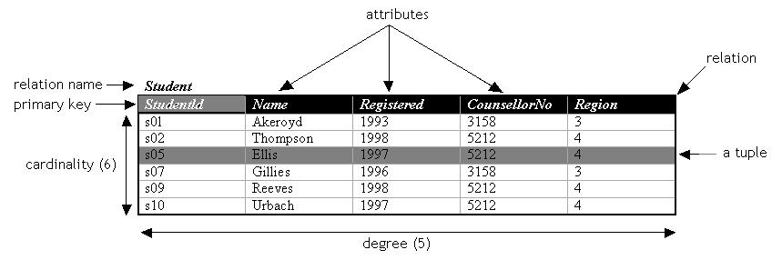
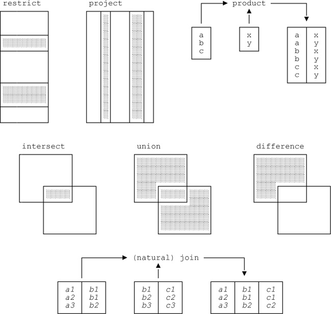
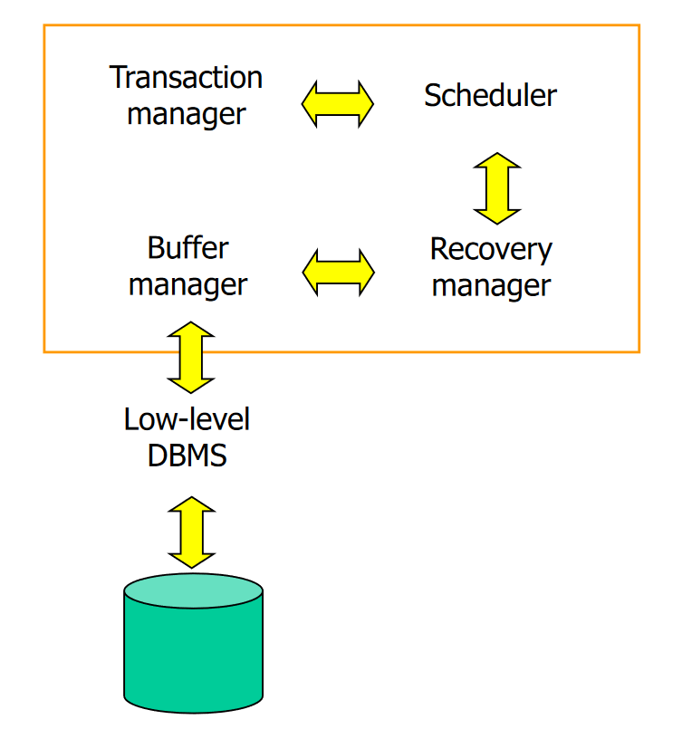

Introduction to databases
=========================

Electronic databases have been created to:

-   Decentralize information management

-   Improve performance (inserting and reading)

-   Reduce data loss, duplication, and incompatibility issues

Terminology
-----------

-   **Relation** ─ A two-dimensional table. AKA File.

-   **Row** ─ An individual row of the table. AKA Record, Tuple.

-   **Attribute** ─ A named column of a relation. AKA Field.

-   **Cardinality** ─ Number of rows.

-   **Degree** ─ Number of columns.

-   **Domain** ─ A set of allowed values of a specific attribute.

{width="6.263888888888889in"
height="2.1666666666666665in"}

Properties of relations
-----------------------

-   The name of the relation is unique.

-   The names of an attribute in unique only within its relation.

-   The values of an attribute are all from the same domain.

-   The order of attributes within a relation has no significance.

-   The order of rows within a relation has no significance.

-   The records within a relation should all be distinct.

-   Each cell of a relation should contain at most *one value*.

Keys
----

*Relational keys* consist of one or a set of attributes used to uniquely
identify a row in a relation.

### Super-key

A super-key is any attribute (or set of attributes) that uniquely
identifies a row. They may contain attributes that are not strictly
required for unique identification.

### Candidate key

A candidate key is a super-key where all columns are needed to uniquely
identify a row. A candidate key for a relationship has the following
properties:

-   **Uniqueness**: no two rows of the table can have the same value of
    the candidate key.

-   **Irreducibility**: no subset of the candidate key has the
    *uniqueness* property.

[To correctly identify a candidate key, we need to be aware of the
meanings of the attributes in the real world, and think about whether
duplicates could arise for a given choice of key.]{.underline}

### Primary key

A primary key is a candidate key that has been chosen to be the default
way of identifying a row. If there is no natural attribute suitable as
primary key, an **artificial key** can be created instead.

### Foreign key

A foreign key is an attribute, or set of attributes, that uniquely
identifies a record of another relation, thus representing a
relationship between them.

Relational integrity
--------------------

### Entity integrity

In a relation, no attribute of a primary key can be **null**.

### Referential integrity

In a relation, the value of a foreign key must **either exist** as a
value of another attribute in a different, or the same, relation **or be
null**.

ER Modelling
============

Weak entities
-------------

Entities that cannot exist without a parent entity. E.g. movie
\-\--*burned onto*\--\> **DVD**

Unary relationships
-------------------

Entities that have a relationship with entities of the same relation.

Relationships
-------------

...

SQL
===

SQL (Structured Query Language) is a declarative language (the logic is
described without any control flow) for manipulating a relational
database. Commands can be issued to perform the following tasks:

-   Creating and managing tables

-   Inserting data into tables

-   Searching and retrieving data from tables

-   Deleting data and tables

MySQL is a dialect of SQL.

Database engines
----------------

MySQL supports different database engines, each designed for different
needs.

Table constraints
-----------------

Table can have constraints such as **foreign keys** or **default**
values.

MySQL statements
----------------

There are a few good practices and rules that should be used with MySQL,
and SQL in general, to avoid confusion, or errors, in SQL statements:

-   **Keywords** should be written in uppercase to distinguish them from
    table names, attributes, etc.

-   **Strings** must be enclosed in single or double quotes.

-   **Database elements** such as tables and fields should be enclosed
    between grave accents (\`).

-   **Statements** should be separated by semi-colons.

*Example:*

SELECT \`ingredients\` FROM \`recipes\` WHERE \`name\` = "arancino";

Grave accents are not always necessary though:

SELECT ingredients FROM recipes WHERE name = "cipollina";

Data types
----------

Choosing the data type for a column is something that should be done
carefully because of the different sizes they have, the range of their
values, and the operations that can be performed on the data they
contain.

The following are the data types supported by MySQL 5.7.8. Modifiers can
be used to create other datatypes. For instance, specifying the CHAR SET
*binary*, CHAR becomes BINARY, VARCHAR becomes VARBINARY, and TEXT
becomes BLOB.

### Numeric Type

  **Type**       **Storage**   **Minimum Value**       **Maximum Value**
  -------------- ------------- ----------------------- -----------------------
  ** **          **(Bytes)**   **(Signed/Unsigned)**   **(Signed/Unsigned)**
  TINYINT        1             -128                    127
                               0                       255
  SMALLINT       2             -32768                  32767
                               0                       65535
  MEDIUMINT      3             -8388608                8388607
                               0                       16777215
  INT, INTEGER   4             -2147483648             2147483647
                               0                       4294967295
  BIGINT         8             -9223372036854775808    9223372036854775807
                               0                       18446744073709551615

  **Data Type**                                                                                                   **Storage Required**
  --------------------------------------------------------------------------------------------------------------- -----------------------------------------------------------
  FLOAT(*p*)                                                                                                      4 bytes if 0 \<= *p* \<= 24, 8 bytes if 25 \<= *p* \<= 53
  [[FLOAT]{.underline}](https://dev.mysql.com/doc/refman/5.7/en/floating-point-types.html)                        4 bytes
  DOUBLE \[PRECISION\], [[REAL]{.underline}](https://dev.mysql.com/doc/refman/5.7/en/floating-point-types.html)   8 bytes
  DECIMAL(*M*,*D*), NUMERIC(*M*,*D*)                                                                              Varies; see following discussion
  BIT(*M*)                                                                                                        approximately (*M*+7)/8 bytes

### Date and Time Type

  **Data Type**                                                                      **Storage Required as of MySQL 5.6.4**
  ---------------------------------------------------------------------------------- ----------------------------------------
  [[YEAR]{.underline}](https://dev.mysql.com/doc/refman/5.7/en/year.html)            1 byte
  [[DATE]{.underline}](https://dev.mysql.com/doc/refman/5.7/en/datetime.html)        3 bytes
  [[TIME]{.underline}](https://dev.mysql.com/doc/refman/5.7/en/time.html)            3 bytes + fractional seconds storage
  [[DATETIME]{.underline}](https://dev.mysql.com/doc/refman/5.7/en/datetime.html)    5 bytes + fractional seconds storage
  [[TIMESTAMP]{.underline}](https://dev.mysql.com/doc/refman/5.7/en/datetime.html)   4 bytes + fractional seconds storage

### String Type

In the following table, **M** represents the declared column length in
characters for nonbinary string types and bytes for binary string types.
**L** represents the actual length in bytes of a given string value.

  **Data Type**                                                                                                                                                  **Storage Required**
  -------------------------------------------------------------------------------------------------------------------------------------------------------------- ----------------------------------------------------------------------------------------------------------------------------------------------------------------------------------------------------------------------------------------------------------------------------------------------------------------------------------------------------------------
  CHAR(*M*)                                                                                                                                                      *M* × *w* bytes, 0 \<= *M* \<= 255, where *w* is the number of bytes required for the maximum-length character in the character set. See [Section 14.8.1.2, "The Physical Row Structure of an InnoDB Table"](https://dev.mysql.com/doc/refman/5.7/en/innodb-physical-record.html) for information about CHAR data type storage requirements for InnoDB tables.
  BINARY(*M*)                                                                                                                                                    *M* bytes, 0 \<= *M* \<= 255
  VARCHAR(*M*), VARBINARY(*M*)                                                                                                                                   *L* + 1 bytes if column values require 0 − 255 bytes, *L* + 2 bytes if values may require more than 255 bytes
  [[TINYBLOB]{.underline}](https://dev.mysql.com/doc/refman/5.7/en/blob.html), [[TINYTEXT]{.underline}](https://dev.mysql.com/doc/refman/5.7/en/blob.html)       *L* + 1 bytes, where *L* \< 2^8^
  [[BLOB]{.underline}](https://dev.mysql.com/doc/refman/5.7/en/blob.html), [[TEXT]{.underline}](https://dev.mysql.com/doc/refman/5.7/en/blob.html)               *L* + 2 bytes, where *L* \< 2^16^
  [[MEDIUMBLOB]{.underline}](https://dev.mysql.com/doc/refman/5.7/en/blob.html), [[MEDIUMTEXT]{.underline}](https://dev.mysql.com/doc/refman/5.7/en/blob.html)   *L* + 3 bytes, where *L* \< 2^24^
  [[LONGBLOB]{.underline}](https://dev.mysql.com/doc/refman/5.7/en/blob.html), [[LONGTEXT]{.underline}](https://dev.mysql.com/doc/refman/5.7/en/blob.html)       *L* + 4 bytes, where *L* \< 2^32^
  ENUM(\'*value1*\',\'*value2*\',\...)                                                                                                                           1 or 2 bytes, depending on the number of enumeration values (65,535 values maximum)
  SET(\'*value1*\',\'*value2*\',\...)                                                                                                                            1, 2, 3, 4, or 8 bytes, depending on the number of set members (64 members maximum)

Relational algebra
==================

Relational algebra is the theoretical basis for programming languages
like SQL. It contains operators that define operations on one or more
relations, and allow to create new relations from the given ones.

The main five operators in Relational Algebra are:

-   **Selection**

-   **Projection**

-   **Union** (or addition)

-   **Difference**

-   **Product**

Other derived operators are the combination of the fundamental
operators:

-   **Join**

-   Intersection

-   Division

Projection
----------

R1 := π~L~ (R2)

-   L is a list of attributes from the schema of R2.

R1 is constructed by looking at each tuple of R2, extracting the
attributes on list L, in the order specified, and creating from those
components a tuple for R1.

-   Eliminate duplicate tuples, if any.

SQL clause: **SELECT DISTINCT**.

Selection
---------

R1 := σ~C~ (R2)

-   C is a condition (as in "if" statements) that refers to attributes
    of R2.

-   R1 is all those tuples of R2 that satisfy C.

SQL clause: **WHERE**.

Product
-------

R3 := R1 x R2

-   Pair each tuple t1 of R1 with each tuple t2 of R2.

-   Concatenation t1t2 is a tuple of R3.

-   Schema of R3 is the attributes of R1 and then R2, in order.

-   But beware of attributes with same names: use the relation name as a
    prefix for the attributes.

Joins
-----

Joins are a sequence of operations combined to produce a sensible
result. There are different types of joins, such as natural join,
equi-join, outer join, etc.

### Theta-join

R3 := R1 ⋈~c~ R2

1.  Take the **product** R1 x R2.

2.  Apply **σ~C~** to the result.

The condition can be any boolean-valued condition.

### Natural join

R3 := R1 ⋈ R2

The natural join operator is a combination of product, selection, and
project where the result is the set of all combinations of tuples in R1
and R2 that are equal on their common attributes.

1.  Take the **product** of R1 x R2.

2.  Apply **σ~C~** to the result so that only the equal values on the
    common attributes are taken.

3.  Finally, apply **π~L~** so that each common attribute appears only
    once in the final result.

Union, intersection, and difference
-----------------------------------

When using union, intersection, or difference operators, both operands
must have the same relation schema, meaning that both relations must
have the same degree and attributes must have the same name.

Compatibility problems may be solved by projecting the necessary
attributes first.

{width="4.063852799650044in"
height="3.861111111111111in"}

*Image by Vittorio Iocoland*

*\
*

Normalisation
=============

Backup and concurrency
======================

A DBMS must ensure that the underlying database is **reliable** and
remains in a **consistent** state. Both properties must be maintained
also in case of hardware or software failures.

Since DBMS often allow users to perform simultaneous operations on the
data, **concurrency** must be handled appropriately. Furthermore,
**recovery control** is required to protect it from inconsistencies and
data loss.

Transactions
------------

A transaction is an action, or a series of actions, carried out by a
single user or an application which accesses or changes the content(s)
of a database. If a transaction is completed, it is **committed** and
the database reaches a new consistent state. If the transaction does not
execute successfully, it is **aborted** and the database must be brought
back to a consistent state through a **roll-back**.

Properties of transactions
--------------------------

All transaction should possess four basic so-called **ACID** properties:

-   **Atomicity**

    A transaction is an indivisible number of operations performed
    entirely or not performed at all.

-   **Consistency**

    A transaction transforms the database from a consistency state into
    another.

-   **Isolation**

    Transactions execute independently of one another. Partial effects
    of an incomplete transaction should not be visible to other
    transactions, but they should be seen as executed one after another.

-   **Durability**

    Once has transaction has been committed, its effects should not be
    lost in the event of any error.

Keywords
--------

A DBMS has no way of knowing which updates are grouped together to form
a single, logical transaction. Therefore, the user must be provided with
a way to indicate the boundaries of each transaction. For example, there
may be keywords such as **BEGIN\_TRANSACTION**, **COMMIT**, and
**ROLLBACK** to delimit a transaction. If such delimiters are not used,
the whole program is usually treated as a single transaction with the
DBMS automatically performing a COMMIT upon successful termination, or
ROLLBACK if not.

Database architecture
---------------------

The **transaction manager** coordinates transactions on behalf of
application programs. It communicates with the scheduler, which
implements a particular strategy for concurrency control. The
**scheduler** tries to maximise concurrency without allowing
transactions to interfere with one another.

If failure occurs during a transaction, the **recovery manager** ensures
that the database is restored to the state it was in before the start of
the transaction. The **buffer manager** is responsible for the transfer
of data between disk storage and main memory.

{width="3.111111111111111in"
height="3.2779374453193353in"}

Concurrency control
-------------------

**Concurrency control** is the process of managing simultaneous
operations on the database without having them interfere with each
other. When one or more users are updating some data, the database must
handle the transactions so that each one works on a consistent state of
the database. This is insured by using either a **read or a write
lock**.

-   **Read Lock** ─ *Shared* lock that prevents other transaction to
    write.

-   **Write Lock** ─ *Exclusive* lock that prevents other transaction to
    read and write.

Using locks in the wrong way can lead to **dead locks**, which are
situations where two or more transactions wait for one another without
being able to release the locks, thus interfering with the database
functioning. To solve this problem, locks should be requested when the
transaction is started (**growing phase**) and removed when the
transaction is concluded (**shrinking phase**).

**Two-phase locking** protocol is used to prevent deadlocks using two
simple rules:

-   A transaction must acquire a lock on an item before operating on it.

-   Once the transaction release the lock, it cannot acquire new locks.

However, this protocol introduces new problems such as **cascading
rollbacks:**

-   2PL allows locks to be released before the final commit or rollback
    of a transaction.

-   During this time, another transaction may acquire the locks released
    by the first transaction, and operate on the results of the first
    transaction.

-   If the first transaction subsequently aborts, the second transaction
    must abort since it has used data now being rolled back by the first
    transaction.

This problem can be avoided by preventing the release of locks until the
final commit or abort action.

Recovery
--------

**Recovery Control** is the process of restoring the database to a
consistent state in case of failure. During this process, the DBMS must
ensure that all the ACID properties are still valid.

There are two main effects of a database fault:

-   The loss of main memory, including database buffers.

-   The loss of disk copy of the database.

DBMS usually provides the following tools to perform an emergency
recovery:

-   **Backup mechanism**: make periodic backups of the database.

-   **Logging facilities**: keep track of the current state of
    transaction.

-   **Checkpoint facilities**: enable in-progress updates to be made
    permanent.

-   **Recovery manager**: restores the system to a consistent state
    after a failure.4

Logs primarily contain **transaction records** which contain:

-   The transaction identifier

-   The record type (transaction start, insert, update, delete, abort,
    commit)

-   The identity of the affected data (for insert, update, and delete)

-   **Before-image** (the value before it's been updated)

-   **After-image** (the value after it's been updated)

-   Log information

**\
**

**Checkpoints** are points of synchronization between the database on
disk and the transactions log file. [At the time of a checkpoint, all
buffers are force-written onto the disk.]{.underline}

When a crash occurs, the recovery manager examines the log file for the
last checkpoint recorded:

-   All **transactions** that have **committed** since the last
    checkpoint (after) are **redone**.

-   Any **active transaction** at the time of the crash is **undone**.

**Deferred updates**, in contrast to *immediate updates*, only makes a
transaction persistent after it has been committed, thus -- if a
transaction (deferred) fails before committing -- it will not have
modified the database.

Log:

When **immediate updates** transactions are performed, in the event of a
crash, it may be necessary to undo any changes if the transaction will
have reached a checkpoint without committing.

Log: transacting that have both started and committed, are **redone**
using the **after-image**, while transacting that have been started, but
not committed, are **undone** using the **before-image**.

Changes have to be undone when using immediate mode using the
after-image. In any case, they have to be redone with the after-image
when the commit is done after the checkpoint.
