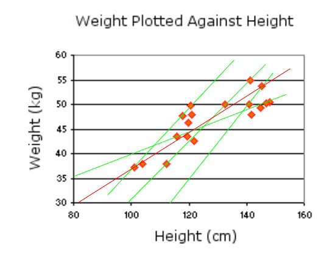
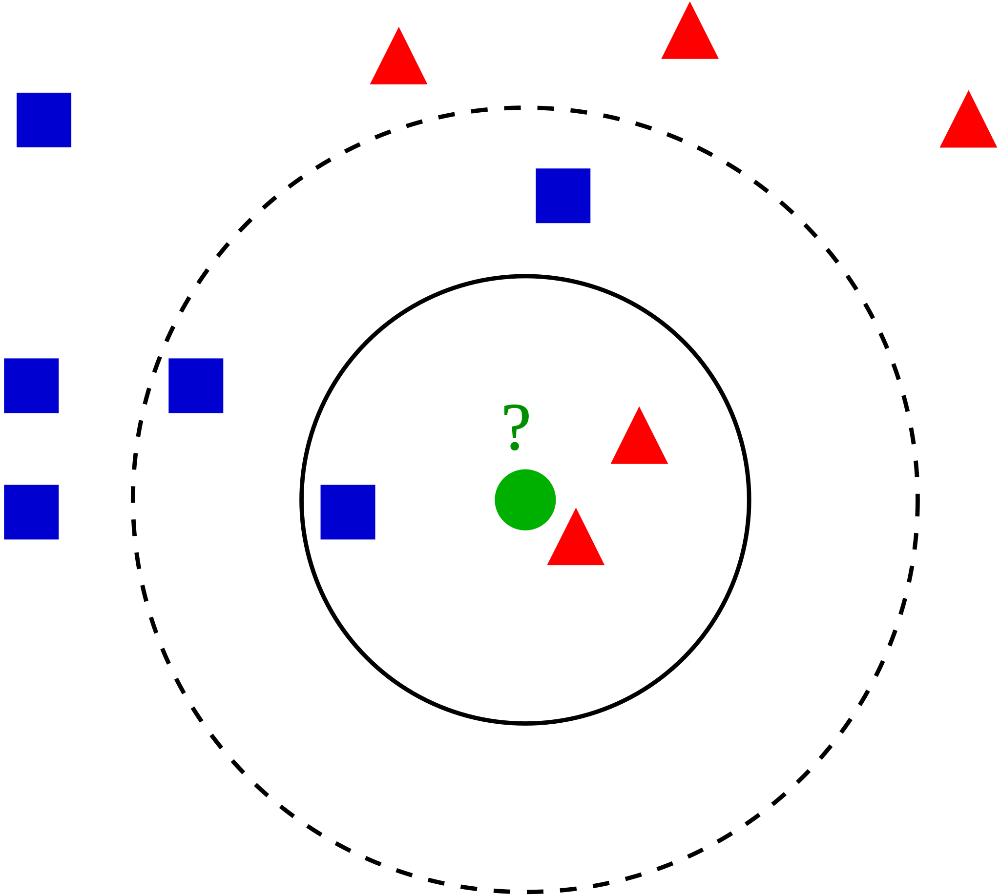
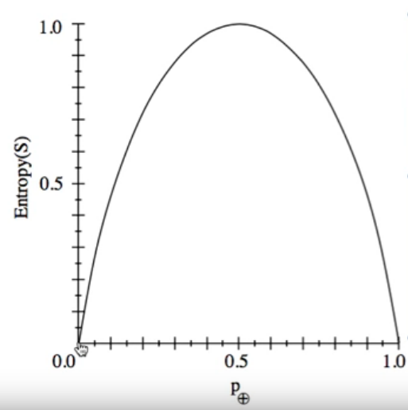

# Introduction

## What is data mining?

Data mining is the exploration and analysis of large quantities of data in order to discover valid, novel, potentially useful, and ultimately understandable patterns in data. It is also known as Knowledge Discovery in Databases (KDD).

In order to gain knowledge from the data, it has to go through many processes to separate useful data from less useful data.

## Where does data come from?

Data comes from the real world, but it is usually only a snapshot, or a sample, of the real world. Data mining assumes that the user's data from the past will be similar in the future, that is why it is used to predict future behaviour.

## Problems with data

There are some problems that have to be kept into account when using data:
- Errors: data might be wrong or missing
- Quantity: is it enough?
- Quality: does the data contain the needed information?
- Cost: is it expensive to get it?

## What is mined and why?

The data captured is mostly used to determine relationships between variables (e.g. price affecting sales) and/or common patterns in categories (e.g. fraudulent bank activities). This data could have many uses such as targeted advertising, alerting customers when their credit card is involved in suspicious activities, etc.

## Techniques

- K - nearest neighbour
- Decision trees
- Neural networks
- K - means clustering
- ARIMA

# Data preparation

In data mining, **data must be appropriate** for the task, so that running a data mining algorithm will produce good results. For this reason, before running the algorithm, it is necessary to ensure that the data **quantity** is sufficient and that it is of good **quality**. To ensure that the quality is appropriate, it is necessary to check the its distribution.

## Distribution

A frequency distribution is the frequency or **count of occurrences** of values within a particular group or interval. For discrete values, this is simply the count of occurrences for each value, while for continuous values, it is the number of occurrences of values that fall within a sub-range.

Some features to look for in a distribution are:

- Outliers: values that are distant from the rest of the data; collect more data or discard
- Infrequent values: values that appear infrequently; collect more data or discard
- Flat and Wide variable: all values are minority values; *should be excluded*
- Data balance
- Data entry errors

### Outliers

In statistics, an outlier is an observation that is numerically distant from the rest of the data. Since they can be harmful to the data mining process - like infrequent values, they should be either removed or, if important, more data should be collected to reflect an aspect of the model being created.

### Data balance

In order for data to be balanced, it has to be collected using the same proportions across all samples. E.g. when mining is performed on a supermarket customers data, the information has to be collected in in the same quantity from both regular customers and non-regular customers, otherwise the model created WON'T be able to recognize patterns across all the data.

### Data quantity

The quantity of data that has to be collected must:

- Be sufficient to represent the system modeled;
- Cover all situations;
- Compensate for any noise in the data.

## Linearity

Data is linear when all the values of the plotted variables lie on the same line of the graphic. If the data relationship is linear, only 2 values are needed to plot the function. If the data collected is not linear, but is sparse instead, the graphic will probably contain multiple non-aligned lines. The distance between a point and the central line represents the error of the model and it calculated as the average of the squared errors (also known as MSE or mean squared error).

The spread of data could be caused by different factors, such as:

- Imperfect measurements or noise
- Variability caused by other factors
- Random factors

In order to obtain a single line that represents a general model for all the data, it is necessary to minimize the MSE. There are different methods that can be used to achieve this, such as:

- **Classification**
- **Linear regression**
- **Logistic regression**
- etc.

# Classification

Classification is a technique to used to assign an object to a certain category based on its similarity to previously classified objects. Different techniques can be used to classify objects, each with different pros and cons.

## Techniques

- Non-paremetric, e.g. k-nearest neighbors
- Mathematical models, e.g. neural networks
- Rules based models, e.g. decision trees

### K-nearest neighbors

*"K-nearest neighbors (k-NN) is a non-parametric method used for classification and regression.
\
- In k-NN classification, the output is a class membership. An object is classified by a majority vote of its neighbors, with the object being assigned to the class most common among its k nearest neighbors (k is a positive integer, typically small). If k = 1, then the object is simply assigned to the class of that single nearest neighbor.
\
- In k-NN regression, the output is the property value for the object. This value is the average of the values of its k nearest neighbors."* -Wikipedia

Example of k-NN classification. The test sample (green circle) should be classified either to the first class of blue squares or to the second class of red triangles. If k = 3 (solid line circle) it is assigned to the second class because there are 2 triangles and only 1 square inside the inner circle. If k = 5 (dashed line circle) it is assigned to the first class (3 squares vs. 2 triangles inside the outer circle). -Antti Ajanki AnAj

### Decision trees

Russel & Norvig - Ch.18.3 - page 697

*"A decision tree is a decision support tool that uses a tree-like graph of decisions and their possible consequences, including chance event outcomes, resource costs, and utility. It is one way to display an algorithm that only contains conditional control statements."* -Wikipedia

[IMAGE]

Having a correct tree structure is important to **optimize the number of correct classifications** and also because the **process has to be as fast as possible**, so it is necessary to minimize the tree depth. Each node of the tree represent a single variable and its branches represent all the possible values that the variable can have.

To perform a single classification, it is necessary to start from the root node of the tree and follow the branches that correspond to the value of each variable until a leaf is reached.

#### ID3

*"ID3 (Iterative Dichotomiser 3) is an algorithm invented by Ross Quinlan used to generate a decision tree from a dataset. ID3 is the precursor to the C4.5 algorithm, and is typically used in the machine learning and natural language processing domains."* -Wikipedia

The algorithm works by splitting the variables based on the ones that have a **information gain**.

##### Entropy

"Entropy is the measure of uncertainty of a random variable; acquisition of information corresponds to a reduction in entropy. A random variable with only one value - a coin that always comes up heads - has no uncertainty and thus its entropy is defined as zero; thus, we gain no information by observing its value. A flip of a fair coin is equally likely to come up heads or tails, and it counts as *1 bit* of entropy" -Russel & Norvig 

Given the set (S), if the outcomes are classified in two categories, positive (P) and negative (N), the entropy of the set can be calculated as:

$$ Entropy (S) \equiv - p(P) log_2(p(P)) - p(N) log_2(p(N))$$

more generally:

$$Entropy (S) \equiv - \sum\limits_{i=1}^{n} p_i log_2(p_i)$$

The graph shows how the entropy increases from 0 when the probability is 0, to 1 when the probability is exactly $$1/2$$, and decreases again to 0 when the probability is 1.

##### Information gain

The information gain, also known as Kullback–Leibler divergence, from the variable test is the expected reduction in entropy. It represents the amount of information that would be needed to specify how a new instance should be classified, e.g. positive or negative. The variable that gives the higher information gain should be chosen as the tree root.

# Data visualization

Since humans are generally good at spotting visual patterns, data visualization should be used to gather more information about a problem, thus being able to choose the most appropriate mining technique.

## Dimensionality reduction

PDF...

# Prediction

Classification - discreet values - often about the present
Prediction - continuous values - often about the future

## Techniques

# Resources

* [Entropy and Information Gain](https://stackoverflow.com/questions/1859554/what-is-entropy-and-information-gain)

