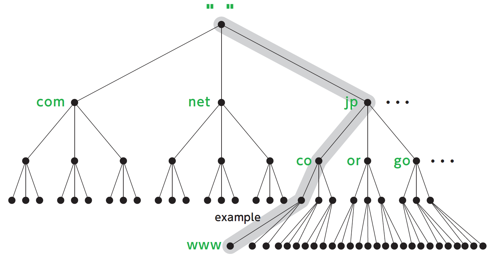
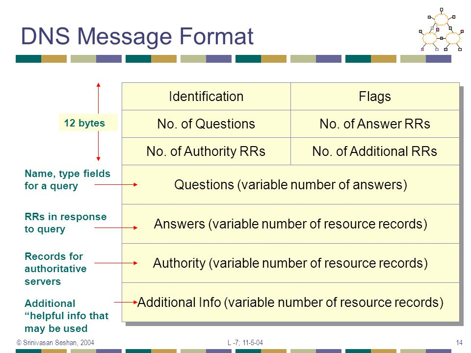

# DNS

*"The Domain Name System (DNS) is a hierarchical decentralized naming system for computers, services, or other resources connected to the Internet or a private network. It associates various information with domain names assigned to each of the participating entities. Most prominently, it translates more readily memorized domain names to the numerical IP addresses needed for locating and identifying computer services and devices with the underlying network protocols. By providing a worldwide, distributed directory service, the Domain Name System is an essential component of the functionality on the Internet, that has been in use since 1985."* -Wikipedia

DNS operates using the UDP protocol on port 53. 
DNS servers employ the Berkley Internet Name Domain (BIND) software to provide their service.

To a first approximation, there are three classes of DNS servers:

- Root DNS servers
- Top-level domain (TLD) servers
- Authoritative DNS servers

For redundancy, security, and load-balancing reasons, there are 13 **root name servers** in the world. Each of them is referred to with a letter of the alphabet. It is important to note that a root DNS server could actually be a cluster of servers. These servers are responsible for the resolution of TLD servers names. **TLD servers** are responsive for top-level domains such as com, org, it, etc. **Authoritative DNS servers** are hosted by ISPs, companies, and Universities. They are used to provide publicly accessible DNS records that map the names of those hosts to IP addresses. In addition to these servers, **local DNS servers** are used to relay queries from the LAN to the Internet

## Iterative vs Recursive queries

## Caching

A critical part of the DNS system is caching. It allows server to temporarily store the IP address of a hostname when it is requested for the first time. When contacted, a DNS server returns the requested information with a specific Time-To-Live (TTL) that tells the server for how long the result will be valid.

## DNS Records and Messages

(Name, TTL, Class, Type, Value)

Class is always IN

### Record types

| Record type | Name           | Value                                  |
| ----------- | -------------- | -------------------------------------- |
| A           | hostname       | IPv4 address for the hostname          |
| AAAA        | hostname       | IPv6 address for the hostname          |
| NS          | domain         | Authoritative DNS for the domain       |
| CNAME       | alias hostname | Canonical hostname                     |
| MX          | alias hostname | Canonical hostname for the mail server |

### Message format

The first 12 bytes (2 bytes for each field) of the message identify the *header section* containing a number of fields grouped by bit octets. These are the fields contained in a query:

- Identification: number used to identify the query (copied into the response)
- Flags: 
    - 1-bit to indicate whether the message is a query (0) or a reply (1)
    - 1-bit to indicate if the server is a authoritative for the queried name
    - \[Query] 1-bit set when the clients want the server to perform the query recursively
    - \[Response] 1-bit set if the DNS server supports recursive queries
- \[Query] Number of questions
- \[Response] Number of answer RRs
- \[Response] Number of authority RRs
- \[Response] Number of additional RRs
- Questions: the question(s) asked to the DNS server
- \[Response] Answer RRs: the question(s) answer(s)
- \[Response] Authority RRs: the authoritative servers for the queried domain
- \[Response] Additional RRs: other information relevant to the query, but not the answer

## Resources

RFC:

- 