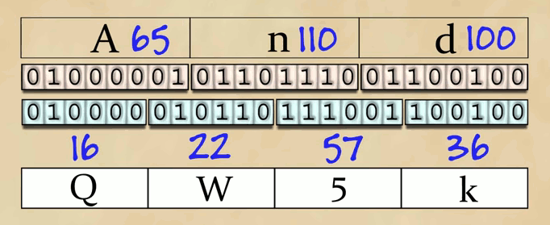

# Application layer

Since an application works on top of the application layer, it is not necessary to write custom software for each system: the packets are handled by the system, router, etc.

## Processes communicating

A process is a program running on a host. Within the same host, two processes communicate using *inter-process communication*, while processes on different hosts communicate by exchanging *messages* across the network.

### Application architectures

- Client-Server
    - A server is always on and has a static IP address.
    - A client communicates with a server, does not necessarily have a static IP address, etc.

- P2P
    - A P2P network is composed of hosts that communicate directly with each other, but arbitrarily.
    - The network peers are intermittently connected and change IP addresses.

- Hybrid Client-Server_P2P
    - Skype
        - Voice over IP (P2P)
        - Centralized server to find contacts, billing, etc.

In a client-server network, clients always initiate the communication, while servers wait for clients to connect. In a P2P network, hosts can assume both client and server roles.

### Sockets

Processes sends messages into, and receives messages from, the network through a software interface called **socket** that acts as a door; it is used by the client to send the message, while the server receives it using the socket on its host.

### Addressing processes

In order to uniquely identify a process, it is necessary to use both the *IP address* of the host and the *port* used by the process.

The application layer protocol defines: 

- Types of messages exchanged
- Message syntax and semantics
- Rules for when and how processes send/receive messages

## Transport Services Available to Applications

Depending on the type of application, it is necessary to choose the transport-layer protocol that suits the needs of the application. This choice has to be made according to the possible services available: 

- **Reliable data transfer** 
    - could be needed to ensure that the data sent by one end of the application is delivered correctly

- **Throughput**
    - *bandwidth-sensitive* require a minimum throughput to work properly (e.g. Skype) 

- **Timing**
    - *real-time* applications might feel unresponsive to clients with a high latency
    - 
- **Security**
    - some application might require confidentiality, so information would have to be en/de-crypted
    - additional features like data integrity or end-point authentication might be provided

## Transport Services Provided by the Internet

Depending on the type of the application, different protocols can be use. TCP/IP networks make use TCP and UDP protocols, each offering a different set of services to the applications.

### TCP Services
 

TCP is a **connection-oriented** service and a reliable data transfer service. This protocol involves a **handshaking** procedure where client and server exchange transport-layer control information before the applications can start sending the actual data. After this phase, a TCP connection is said to exist between the sockets of the two processes. If the processes can exchange messages at the same time, the connection is **full-duplex**, otherwise it is **half-duplex**. When the exchange of information is finished, the connection has to be terminated. This protocol is **reliable** because all data is sent without error and in the proper order.

TCP can implement **SSL** (Secure Sockets Layer), at the application layer level, to encrypt data before is sent through the network. If an application wants to use SSL, it will have to include specific libraries in both client and server applications.

Service that use TCP are mail (**SMTP**), remote terminal access (**telnet/ssh**), web (**HTTP/s**), file transfer (**FTP**), etc. 

### UDP Services

UDP is a **no-frills**, lightweight transport protocol, providing minimal services. It is a **connectionless** protocol, so there is no handshaking before the two processes start to communicate. Being an unreliable data transfer service, UDP provides **no guarantee** that the message will reach the receiving process or that messages will arrive in order. It does not implement a congestion-control mechanism, so data can be sent at any desired rate, yet bandwidth or congestion could be limiting factors.

Services that use UDP are internet telephony (**Skype, RTP**), streaming services (**HTTP**), etc.

# Application-Layer protocols

## Web and HTTP

The HyperText Transfer Protocol (**HTTP**), defined by REF 1945, RFC 2616, RFC 7540 (**HTTP/2.0**), is the web's application-layer protocol that has be implemented in both client and server. It defines the **structure** of the messages exchanged between client and server, but also **how** the messages are exchanged. It is a **stateless** protocol because the server does not retain any information about the client.

### HTTP connections

Client ans servers can communicate using two different modes, either by persistent or non-persistent connections. A connection is said to be **non-persistent** when it is necessary to open a new connection for each resource that the server has to send to the client. 

**Persistent** connections handle all the data transfer over the same TCP connection, thus removing the burden of allocating buffers and storing variables on the server. If non-persistent mode is used, the browser would have to open a connection with the server for each of the resources in a HTML page, even though they can be requested over serial or parallel requests.

**RTT (round-trip time)** is the time that a packets takes to travel from client to server and then back to the client. It includes packet-propagation delays, packet-queueing delays, and packet-processing delays.

Example: when using a non-persistent connection, the transmission time for an HTML file to be transferred is 2RTT + transmission time of the file from the server.

#### Message format

##### HTTP Request

The first line of a request message is called **request line**, while the subsequent lines are called **header lines**. The request line has three fields: *method*, *URL*, and *HTTP version*. The method filed can take values like:

- GET
- POST
- HEAD
- PUT
- DELETE

The HTTP version could be either 1.1 or 2.0.

##### HTTP Response

The first line of a response message is called **status line** and consists of the *protocol version* followed by a *numeric status code* and its *associated textual phrase*. After the status line, there are **header** fields, and then the **entity body**.

The possible status codes are:

      * 1xx: Informational - Request received, continuing process

      * 2xx: Success - The action was successfully received,
        understood, and accepted

      * 3xx: Redirection - Further action must be taken in order to
        complete the request

      * 4xx: Client Error - The request contains bad syntax or cannot
        be fulfilled

      * 5xx: Server Error - The server failed to fulfill an apparently
        valid request

#### Cookies

Cookies are small files stored by browsers that allow servers to associate users' requests with information saved in a database. They can be used to track users' behaviour, keep them logged in while browsing different pages on a website, to keep track of the items they added into the shopping cart, etc.
When the user first visits a website, the response request will include the header *Set-cookie: xxx*. This is used to tell the browser to create the cookie file that will be used to store the user identification string. Using this mechanism, the server - which is stateless - will be able to "remember" the user.

#### Web Caching

A **web cache** - also called **reverse proxy server** - is an host on a network that satisfies requests on behalf of one or more web servers. They are particularly useful to alleviate the network load by caching the requests that clients make towards web servers. If a resource has not been cached yet - or is too old to be served, the proxy server requests it from the web server, stores it for future use, and returns it to the client that originally requested it.

##### Conditional GET

Although caching reduces response times, it introduces a new problem: the cached object may be older than the one on the origin web server. For this reason, HTTP makes use of the **conditional GET** so that the request message includes an *If-Modified-Since:* header line. 
When a client requests an object, the browser - or the cache server - stores the date and time when the resource was last modified. If a request is made for that object, the conditional GET header is used and- if the file was not modified since, the server responds with a code 304 Not Modified and an empty body.

### FTP

**File-Transfer Protocol** (FTP) is used to transfer files between a client and a server. Like HTTP, it makes use of 7-bit ASCII format commands that are sent through a **control connection** over port 21, while files are transferred over a separate **data connection**, usually on port 20. For this reason, FTP is said to send its control information **out-of-band**. FTP servers also need to keep the user's state to know in which directory they are currently located. FTP can operate in two modes:

    - Active: the client listens for incoming data connections from the server
    - Passive: the client sends a PASV command to the server, then receives an IP address and a port number from the server, which the client can use to enstablish a new TCP connection. This is useful when the client is behind a firewall and is unable to accept incoming connections. 

### E-mail

#### SMTP

**Simple Mail Transfer Protocol** (SMTP), defined in RFC 5321, is mail delivery protocol used to transfer mails from client to server on **port 25**. First a connection is established over TCP and the client communicates to the server information such as sender, recipient, then the actual data is sent as a 7-bit ASCII body.

#### POP3

**Post Office Protocol - Version 3** (POP3) is a protocol, defined in RFC 1939, used by user agents to retrieve e-mail from mail servers. It operates on **port 110** and works using three phases:

- authorization
- transaction
- update

#### IMAP

**Internet Message Access Protocol** (IMAP) is a protocol used by user agents to retrieve e-mail messages from a mail server. It has been created to solve the problem of folders and messages management that was available only on client side with POP3. The protocol is defined by RFC 3501 and uses **port 143** to operate. Due to security issues (unencrypted communications), IMAPS (IMAP over SSL) has been developed and operates on **port 993**.

#### Web based e-mail over HTTP(S)

With the increasing speed of the Internet, now we can easily access mail servers through their web interface over HTTP(S) by using a browser. This has made possible to avoid client installation and cumbersome software configurations.

#### MIME

**Multipurpose Mail Extensions** (MIME) is an Internet standard, defined by RFC  that extends the format of email to support:

- Text in char-sets other than ASCII
- Non-text attachments: audio, video, etc.
- Message bodies with multiple parts
- Header information in non-ASCII character sets

When sending a MIME resource, additional headers are added to the mail, then the **base64** encrypted body is added to the mail body. Example:

Headers:
- \[...]
- MIME-Version: 1.0
- Content-Transfer-Encoding: base64
- Content-Type: image/jpg

Body:

H4sICGNm9UwAA3NibWYuc2xmAN2S23LaMBCG7/0UHt+mIB+BdIQzUCCBckgGcAk3jLBlI2JL
riQH3KevwjmZPkFvPOt/vz1pFz7ss1R/x1wQRpuGVTUNHdOQRYQmT

##### Base64

If there are only 2 bytes at the end, an additional character "=" is added at the end of the string, if 1 byte, then "==" is added. 
