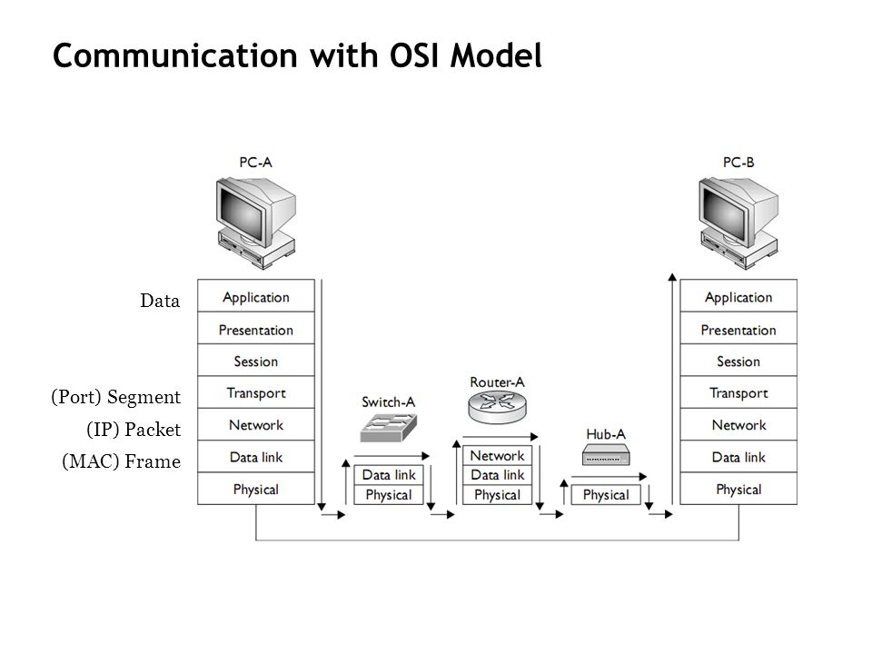

# Introduction

## What is the internet?

The internet is a global **network** of interconnected devices that exchange information with each other. It is divided into the network "edge" and the network  "core". The edge is composed of home, mobile, and institutional networks (hosts), while the core is composed of global and regional ISPs forwarding packets on the network.

The exchange of information is achieved by using many **protocols**,  defined by the RFC, that allow different softwares to communicate, e.g. TCP, IP, HTTP. Protocols are rules that establish the sequence of actions that allow software to communicate on the network.

### Network core

The core is made up of routers and the links between them. Data is routed through the network using either circuit switching and packets switching. 

## Network edge

The network edge consists of the end systems interconnected through routers between themselves. These systems are usually connected to other hosts using a client/server model or a P2P model.

### Communication

Communication between two components of a network happens through a medium:

- Twisted pair: two insulated copper cables
- Coaxial cable: two concentric copper conductors
- Optical fiber: glass fiber carrying light pulses

- Wireless: carried by radio waves

### Circuit switching

In circuit switching there is a dedicated circuit for each call. All the resources are reserved upfront (**bandwidth** on the link and **capacity** on the switch), so that the call quality is the guaranteed. To achieve this, the bandwidth is divided among the users by frequency (FDM) or time slot (TDM). In this case, if a user is not using their resources, no one else will be able to use them in that moment.

(images)

### Packet switching

The resources are shared by all the users, so that each packet uses full link bandwidth. The data is divided into packets that are sent over the network. Since the sequence of packets does not have a fixed pattern, **statistical multiplexing** is used to determine how the bandwidth has to be shared. This process involves routers having to store and forward packets.

#### Packets loss and delay

Packets loss occurs when the *packets arrival rate to link exceeds the output link capacity*. **Nodal delay** is calculated as the following delays:

* **Nodal processing**: 
    + router checking for errors, or 
    + determining the output link
 
* **Queueing**
    + router waiting for other packets
    + the packets are being stored in a queue
    + calculated as (L x a)/R
        + L is the packet length
        + R is the link bandwidth
        + a is the avg packet arrival rate
 
* **Transmission delay**
    + time to send bits to link L (bits)/R (bps)
    + L is the packet length, R is the link bandwidth
 
  * **Propagation delay**
      + is calculated as d/s, where:
      + the length of the physical link (d)
      + the propagation speed in the medium (s), measure in m/s

Packet loss occurs when the queue (or buffer) is full, therefore packets have to be dropped. However, dropped packets *may* be retransmitted by the previous node (e.g. TCP protocol). 

Throughput is maximum the rate (bits/time_unit) at which bits are transferred between sender/receiver. It can be expressed either as **instantaneous** throughput or **average** throughput. If the sender's rate exceeds the receiver's rate, there's a **bottleneck**.

## Protocol stack

The three top layers in the OSI model, i.e. the application layer, the presentation layer and the session layer, are not distinguished separately in the TCP/IP model which only has an application layer above the transport layer.

**Note: this module is taught using the TCP/IP model**

### OSI reference model

The OSI (Open Systems Interconnection) model is a conceptual model used to standardize the communication functions of a computing system without regard to its internal structure. Its goal is the interoperability of different communication systems with standard protocols

7. **Application**
    - Where the application comes in contact with the model
    - Identifies the protocols that the end user has
    - Protocols that exist on this layer: FTP, Telnet, HTTP, SNMP
6. **(Presentation)**
    - Handles format conversion (encoding), and encryption/decryption
    - Also referred to as *syntax layer*
5. **(Session)**
    - Manages the flow of events that establish/terminate network connections
    - Allows exchanges between applications to occur by creating the communication channel (session)
4. **Transport**
    - Handles packetization of data
    - Provides transfer of data (how the data arrives to the application, e.g. TCP, UDP)
    - Responsible for error recovery
3. **Network**
    - Logical pathway layer / Virtual circuit layer
    - Responsible for routing datagrams from source to destination
    - Congestion control and packet sequencing
    - Makes sure that packets arrive to their destination
2. **Data link**
    - Where the packets of data are encoded into bits
    - Responsible for *error detection*
    - Divided into 2 sub-layers:
        1. MAC layer
        2. LLC (Logical Link Control)
            - Controls frame synchronization and flow control, and error checking
1. **Physical**
    - Concerned with the transmission/reception of the unstructured raw bits over the connection medium

