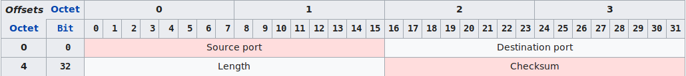
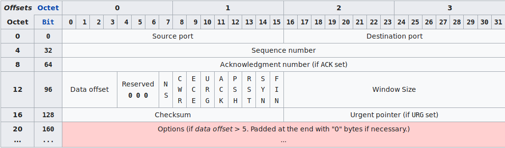
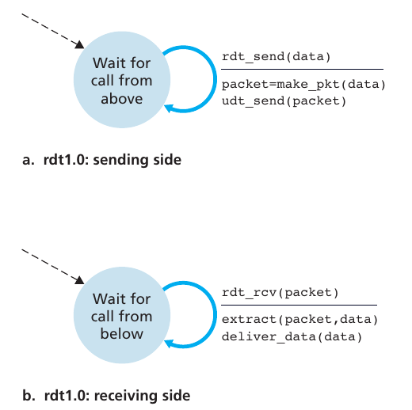
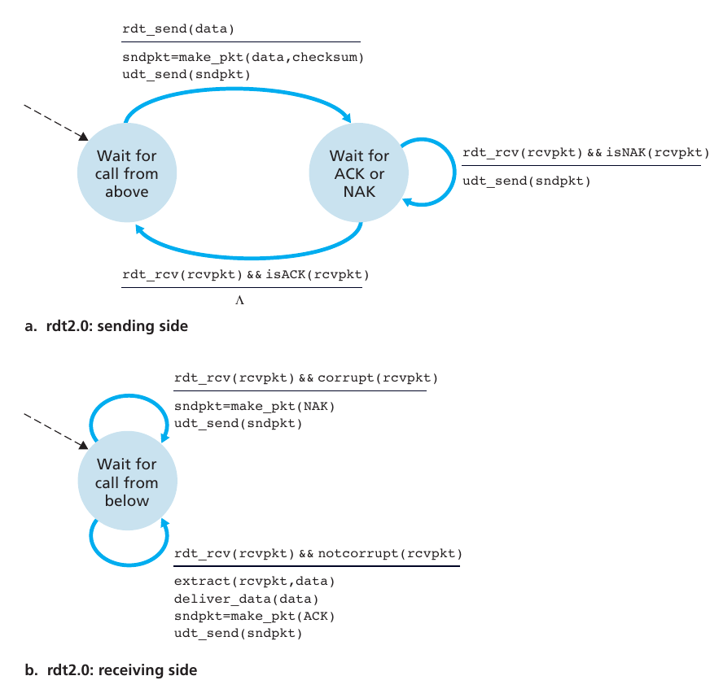
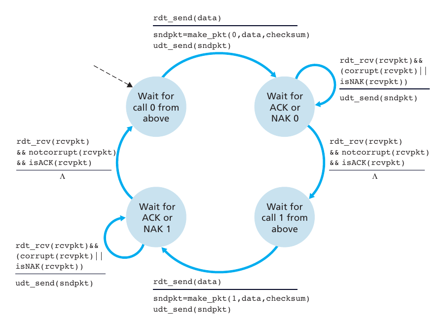
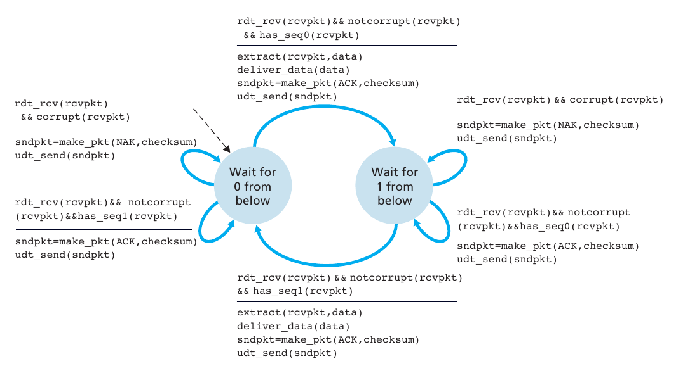
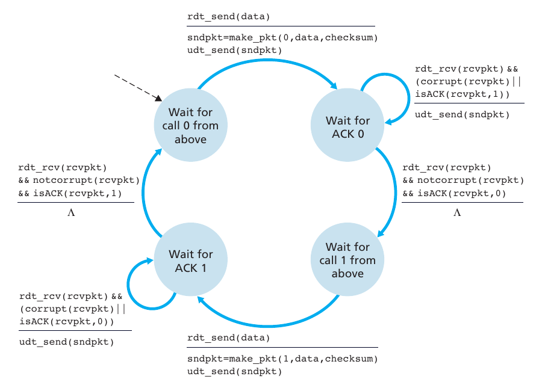
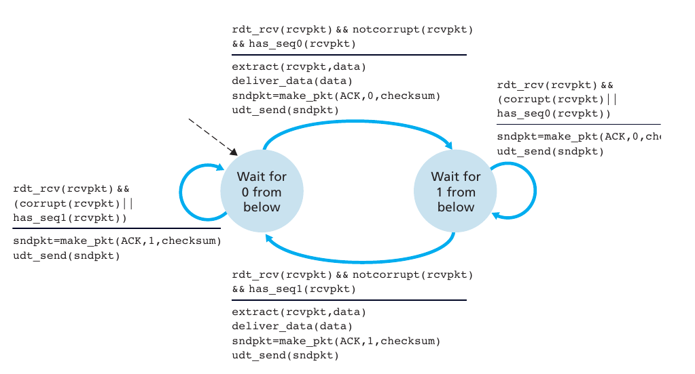
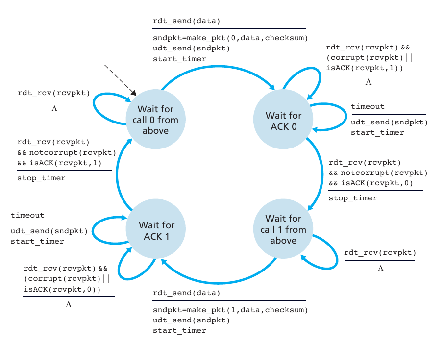

# Introduction

*"A transport-layer protocol provides for **logical communication** between application processes running on different hosts."* Logical connection means that, from the applications' perspective, it is as if the hosts were directly connection, even though they could be very distant from each other.

Transport-layer protocols are implemented in the end system but not in network routers. 

On the sending side, the transport layer converts the messages from a sending application into transport-layer packets, known as transport-layer **segments**. This is done by splitting the application messages into smaller chunks and adding a transport-layer header to each chunk to create a segment. After the segment is created, it is passed to the network layer where the segment is encapsulated within a network-layer packet, known as **datagram**.

On the receiving side, the network layer extracts the segment from the datagram and sends it up to the transport layer, which then processes the segment and makes the data available to the application layer.

## Transport and Network layers

It is import to note that whereas a transport-layer protocol provides logical communication between processes, a network-layer protocol provides communication between hosts.

# Internet transport-layer protocols

Depending on the type of the application, different protocols can be use. TCP/IP networks make use TCP (Transmission Control Protocol) and UDP (User Datagram Protocol) protocols, each offering a different set of services to the applications.

To simplify terminology, when in an Internet context, we refer to the transport-layer packet as a segment. However, the Internet literature also refers to the transport-layer packet for TCP as a segment but often refers to the packet for UDP as a datagram.

For the correct terminology, check [RFC 1122 - Section 1.3.3](https://tools.ietf.org/html/rfc1122#page-17)

### TCP
 

TCP is a **connection-oriented** service and a reliable data transfer service. This protocol involves a **handshaking** procedure where client and server exchange transport-layer control information before the applications can start sending the actual data. After this phase, a TCP connection is said to exist between the sockets of the two processes. If the processes can exchange messages at the same time, the connection is **full-duplex**, otherwise it is **half-duplex**. When the exchange of information is finished, the connection has to be terminated. This protocol is **reliable** because all data is sent without error and in the proper order.

TCP can implement **SSL** (Secure Sockets Layer), at the application layer level, to encrypt data before is sent through the network. If an application wants to use SSL, it will have to include specific libraries in both client and server applications.

### UDP

UDP is a **no-frills**, lightweight transport protocol, providing minimal services. It is a **connectionless** protocol, so there is no handshaking before the two processes start to communicate. Being an unreliable data transfer service, UDP provides **no guarantee** that the message will reach the receiving process or that messages will arrive in order. It does not implement a congestion-control mechanism, so data can be sent at any desired rate, yet bandwidth or congestion could be limiting factors.

# Multiplexing & De-multiplexing

The job of gathering data chunks at the source host from different sockets, encapsulating each data chunk with header information to create segments, and passing the segments to the network layer is called **multiplexing**. The job of delivering the data in a transport-layer PDU (segment or datagram) to the correct socket is called **de-multiplexing**.

## UDP

1. Host A creates a socket on a non-reserved port, i.e. 1024-65535
2. Transport layer creates one or more UDP datagrams containing:
    - source port
    - destination port
    - length
    - checksum
3. The UDP datagram is sent down the protocol stack, then sent to host B

UDP header:

Source: Wikipedia

UDP sockets are identified by a two-tuple: 
- source port number
- destination port number

The source port number will be used by the receiving host to know where the response, if any should be sent. If two UDP datagrams have different source IP address and/or source port numbers, but have the same destination IP address and destination port number, then the two segments will be directed to the same destination process through the same destination socket.

### UDP Checksum

The UDP checksum is used to determine whether bits within the UDP datagram have been altered as it was transferred from source to destination. 

"On the sending side, one's complement sum is performed on all the 16-bit values then the one's complement (i.e., invert all bits) is taken of that value to populate the checksum field (with the extra condition that a calculated checksum of zero will be changed into all one-bits).

The one's complement sum is not just the sum of all the one's complement values. It's a little more complex.

Basically, you have a running 16-bit accumulator starting at zero and you add every 16-bit value to that. Whenever one of those additions results in a carry, the value is wrapped around and you add one to the value again. This effectively takes the carry bit of the 16-bit addition and adds it to the value."

The sum of all the 16-bit words and the checksum should be 1111 1111 1111 1111. If a 0 bit is present, then the segment has been altered.

## TCP

TCP sockets are identified by a four-tuple:
- source IP address
- source port number
- destination IP address
- destination port number

TCP header:

Source: Wikipedia

When a TCP segment arrives to a host, the receiving host uses all four values to demultiplex the segment to the appropriate socket. 

"A server socket listens on a single port. All established client connections on that server are associated with that same listening port on the server side of the connection. An established connection is uniquely identified by the combination of client-side and server-side IP/Port pairs. Multiple connections on the same server can share the same server-side IP/Port pair as long as they are associated with different client-side IP/Port pairs, and the server would be able to handle as many clients as available system resources allow it to.

On the client-side, it is common practice for new outbound connections to use a random client-side port, in which case it is possible to run out of available ports if you make a lot of connections in a short amount of time." -Remy Lebeau on StackOverflow

# Principles of Reliable Data Transfer

A reliable data transfer (rdt) protocol ensures that the data sent from host A to host B has not been altered during its way. When data is transferred using a reliable channel, no bits are corrupted (flipped from 0 to 1, or vice versa) or lost, and all are delivered in the order in which they were sent. This is what TCP offers to Internet applications. This task is made difficult by the unreliability of IP protocol.

## rdt1.0

This is the first prototype of a rdt protocol. It does not implement any error checking, feedback mechanism, so the sender has not way to know if the data has been correctly received or not.

## rdt2.0

This is a slightly improved version of rdt. It implements a feedback mechanism through ACK and NAK packets, but it cannot guarantee that the feedback packet hasn't been corrupted during the transfer. This type of protocols are known as **Automatic Repeat reQuest** (ARQ) protocols and **stop-and-wait** protocols.

It implements:

- error detection: checksum (UDP)
- receiver feedback: ACK and NAK
- retransmission: malformed packets are retransmitted

The main problem for this protocol is that ACK or NAK packet could become corrupt, also introducing new challenges. A solution to this problem is to make the sender host re-send the packet when the feedback packet is malformed. A sequence number is also added to the packet to avoid duplicated packets so that the receiver is able to detected whether or not the received packet is a retransmission.

## rdt2.1

To resolve the problem of malformed feedback packets, rdt2.1 implements both ACK and NAK from the receiver to the sender, but this complicates the FSM diagram.

### Sender

### Receiver

## rdt2.2

This version is a NAK-free version of the rdt protocol. This is achieved by including the sequence number of the packet that is being acknowledged ACK, so that also the sender has to check which packet is being acknowledged.

### Sender

### Receiver

## rdt 3.0

**Works over a lossy channel with bit errors.**

If we suppose that in addition to being corrupted, the transfer channel can lose packets as well, the protocol must also implement a way to detect packet loss and what to do when this occurs. In the following example the sender will be detecting and recovering lost packets.

### Sender

In order to know if a packet has been lost, the sender must wait long enough so that - if the receiver does not send an acknowledge packet, it can simply retransmit the data. The main problem with this approach is that the worst-case delay may be hard to estimate and the protocol must recover as soon as possible. It must be noted that if a packet experiences a particularly long delay, the sender might retransmit the packet even though it was already received, thus introducing **duplicate data packets**. This problem was already **solved in rdt2.2** by introducing *sequence numbers*. The data is retransmitted either when a data packet or an ACK is lost.

Implementing this type of protocol requires a **countdown timer** which:

- starts each time a packet is sent
- responds to timer interrupts (?)
- stops

Because the packet sequence numbers alternate between 0 and 1, rdt3.0 is also known as **alternating-bit protocol**.

## Pipelined Reliable Transfer Protocol

Although rdt3.0 is a working protocol, it wouldn't be used with fast connections because of the bottleneck caused by the countdown timer. Pipelining allows the sender to send more packets at once, so that the overall transmission time is reduced. The following changes have to be made:

- Sequence numbers must be increased
- Sender and receiver may have to buffer more than one packet

The range of sequence numbers and buffering requirements will depend on the protocol used to deal with lost, corrupted, or delayed packets.

### Go-Back-N (GBN)

Allows the send to transmit multiple packets without waiting for an acknowledgment, but there is a limit to the number of unacknowledged packets (N) in the pipeline. GBN is referred to as **sliding-window protocol** because of the window size which is the number of packets that is possible to send at the same time.

### Selective Repeat

# Glossary

* TCP: Transmission Control Protocol
* UDP: User Datagram Protocol
* PDU: Protocol Data Unit
* FSM: Finite-State Machine
* Well-known port number: reserved port number from 0 to 1023.